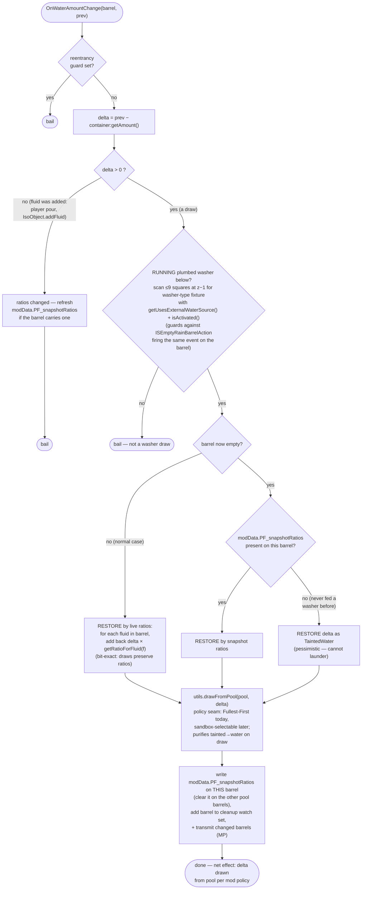
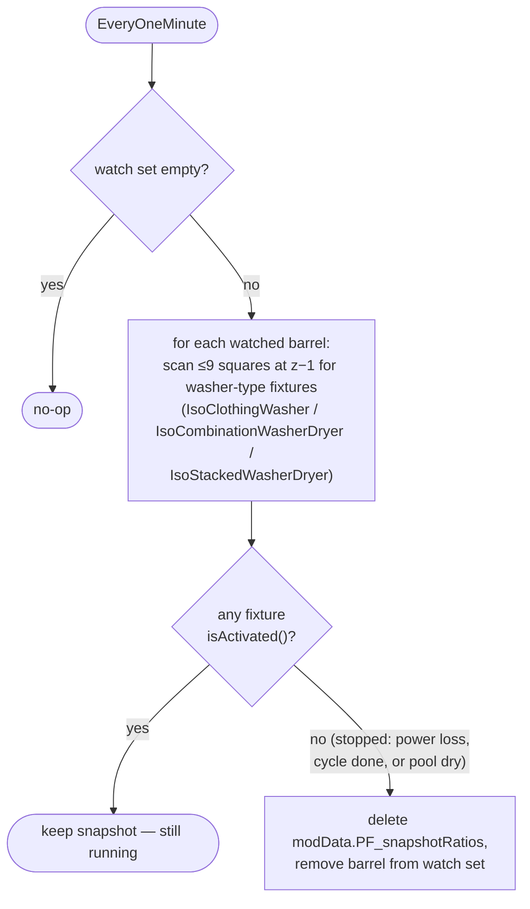

# Washer pooling — design (pending approval)

Make plumbed washers (`IsoClothingWasher`, `IsoCombinationWasherDryer` in washer mode,
`IsoStackedWasherDryer`) draw from the 3×3 barrel pool with the same semantics as the
mod's timed actions: **Fullest-First** draw (v1 behavior — converges to equal levels),
purification on draw, pooled totals.

Status: **implemented** (`server/PlumbingFixed/PFWasherPooling.lua`, `utils.drawFromPool`,
`PFDebugRig` fixture parameter); in-game SP + MP verification still owed. Eventually
folds into [ARCHITECTURE.md](ARCHITECTURE.md).

> **Implementation deviation from the original design:** the handler requires an
> actively **running washer** below the barrel, not just any plumbed fixture. Reason:
> `ISEmptyRainBarrelAction` calls `useFluid`/`emptyFluid` **directly on the barrel**,
> firing the identical event — under a generic plumbed-fixture check, a player emptying
> a pool barrel would be mistaken for a fixture draw and the pool would "refill" the
> barrel they just dumped. Scoping to a running washer eliminates that (residual: doing
> it *while* a washer runs is still mispooled — rare, accepted). Trade-off: vanilla
> `ISWashYourself` (wash self at a sink, not overridden by this mod) drains a single
> barrel vanilla-style; that is a pre-existing gap, out of scope here.

---

## Why this shape (research summary)

The washer's water consumption is **pure Java** — `ClothingWasherLogic.update()` runs
once per game minute on the authoritative side (`!GameClient.client`) and calls
`IsoObject.useFluid(elapsedMinutes)`. Not overridable from Lua. But:

- When plumbed, `useFluid`/`getFluidAmount` delegate to a single cached barrel
  (`externalWaterSource`) and **automatically re-find** a new barrel in the 3×3 at z+1
  whenever the cached one is empty or destroyed (`IsoObject.checkExternalFluidSource`).
- Every Java draw fires `Events.OnWaterAmountChange(barrel, previousAmount)` on the
  authoritative side (`IsoObject.useFluid` → `LuaEventManager.triggerEvent`).
- Direct `FluidContainer` writes (what our utils use) do **not** fire that event —
  post-draw correction is loop-safe by construction.
- `FluidContainer.removeFluid` removes a **proportional slice of every fluid** in the
  container (`remove × getPercentage()` per `FluidInstance`) — so a Java draw does not
  change the barrel's mix ratios, and the removed slice is reconstructible after the
  fact from the surviving ratios.
- B42 taint is **not** binary (that was B41): `TaintedWater` is just a ratio-tracked
  fluid in the mix; poison effects scale with percentage.

### Vanilla shut-off conditions (`ClothingWasherLogic`)

| # | Condition | Notes |
|---|-----------|-------|
| 1 | `!getContainer():isPowered()` | checked every tick, both sides |
| 2 | 90 in-game minutes elapsed | fixed cycle; "clothes clean" is NOT a condition |
| 3 | `getFluidAmount() <= 0` | server-side, **only true when every barrel in the 3×3 is dry** (re-find guarantees this) |

⇒ The washer already stays on as long as the pool has any fluid. This design only fixes
the **drain pattern** (one barrel at a time, no purification, single-barrel UI amount).

### Rain

`FluidContainerUpdateSystem` adds `TaintedWater` (or `Water` if the container is pure
clean water) directly via `FluidContainer.addFluid` every simulation tick — **no event
fires**. Rain is invisible to the handler and harmless: the next draw's redraw pass
recomputes the pool from live values. It is, however, a silent ratio-staleness source
for the snapshot cache (accepted — see below).

---

## Architecture

Three pieces:

1. **`server/PlumbingFixed/PFWasherPooling.lua`** *(new)* — the `OnWaterAmountChange`
   handler. Lives in `server/` so it loads in SP and on a dedicated server — exactly
   where the event fires.
2. **`utils.drawFromPool(waterObject, amount)`** *(new seam in shared utils)* — single
   dispatch point for all pool draws. Today: delegates to `removeWaterTopDown`
   (Fullest-First). Future: reads a sandbox option to pick **Fullest-First** vs
   **Round-Robin** (Round-Robin is stateful — needs a cursor, likely fixture modData —
   deferred until the option is built). All consumers route through it:
   `PFTakeWaterAction`, `PFWashClothing`, `PFCleanBandage`, and this handler.
3. **Ratio snapshot** *(barrel modData)* — `PF_snapshotRatios = { [fluidTypeString] =
   ratio }`, written **only by the washer handler, only on the barrel currently losing
   water**, at the end of each handler run. Consulted **only** in the emptied-barrel
   fallback. Survives server relaunches for free, travels with the barrel, needs no
   registry/eviction, and no `transmitModData` (it is read server-side only).

   **Why nothing else needs to refresh it:** every draw path is ratio-preserving.
   Java draws (`FluidContainer.removeFluid`) and our own draws
   (`moveFluidToTemporaryContainer` → `FluidContainer.Transfer`) both remove
   `amount × getPercentage()` per fluid instance — proportional slices (verified in
   decompiled source). So another player using a sink on the same pool changes barrel
   *amounts* but not *ratios*, and the snapshot stays valid. Only **additions** change
   ratios: additions via `IsoObject.addFluid` fire the event with `delta ≤ 0` (handler
   refreshes then bails); rain and `FluidContainer`-level pours are silent (bounded
   below).

### Handler flow



### Cleanup flow (washer stop)

Java's `setActivated(false)` fires no Lua event, so stop is detected by polling at the
same cadence the washer itself ticks:



The watch set is in-memory by design — it is a cleanup aid, not correctness data. If it
is lost (restart), either the washer resumes (persisted `activated`) and rebuilds it on
the next draw event, or the snapshot lingers until that pool next feeds a washer — the
accepted crash case.

Net effect per event: the pool loses exactly `delta`, taken per the mod's draw policy,
purified — identical semantics to a sink draw. The barrel Java happened to hit fully
participates (if it is the fullest, the redraw takes from it).

### Snapshot rules

The snapshot exists for exactly one case: a Java draw **completely empties** the barrel
(only plausible under fast-forward batching), destroying its `FluidInstance`s so the
live ratios are gone.

| Rule | Detail |
|------|--------|
| **Storage** | Barrel `modData.PF_snapshotRatios` — persists across relaunches, travels with the object, no global registry. Not transmitted (server-side read only). |
| **Store lazily** | Written only by the washer handler, only on the barrel that just lost water, after restore+redraw. One tiny table write per game minute per *running* washer — no scan, no growth beyond barrels that actually feed washers. |
| **No refresh needed on draws** | All draws (Java `removeFluid`, our `moveFluidToTemporaryContainer`/`Transfer`) are proportional → ratio-preserving. A sink drink/wash on the same pool cannot stale the snapshot. |
| **Refresh on additions** | `delta ≤ 0` events (fluid poured in via `IsoObject.addFluid`) change ratios → if the barrel already carries a snapshot, refresh it, then bail. |
| **Accepted staleness** | Rain and `FluidContainer`-level pours shift ratios silently. Bounded and negligible — see the numbers below. |
| **Cleanup on washer stop** | Java's `setActivated(false)` fires no Lua event, so stop is detected by polling on the washer's own cadence: the handler adds F to an in-memory **watch set** when writing a snapshot; an `EveryOneMinute` pass rescans below each watched barrel and, when **no** washer-type fixture (`IsoClothingWasher`, `IsoCombinationWasherDryer`, `IsoStackedWasherDryer`) is `isActivated()`, deletes `PF_snapshotRatios` and unwatches. Additionally, writing F's snapshot clears any snapshot on the other pool barrels — at most one snapshot per pool exists at any moment. |
| **Self-healing after crash** | A crash mid-cycle leaves modData behind, but `activated` is persisted in the save — on restart the cycle resumes, events resume, and the next stop cleans up. Permanent leftovers require a mid-cycle crash after which that pool never feeds a washer again. |
| **Mod uninstall** | There is no "on unregister" hook — an uninstalled mod's Lua never runs, so cleanup-on-uninstall is impossible by definition. With stop-cleanup, leftovers are already rare (see above); any orphaned `PF_snapshotRatios` keys are inert (vanilla ignores unknown modData) and a few dozen bytes per barrel. If we ever care, a debug/admin "strip PF modData" command run *before* uninstalling is the only workable shape. |

### Rain staleness — worst-case numbers

Rain rate (from `FluidContainerUpdateSystem` + entity scripts): `0.005 × intensity ×
RainFactor` per game second ⇒ **`0.3 × intensity × RainFactor` units per game minute**.
Rain collector barrels have `RainFactor 0.4` (400-cap crate) / `0.25` (600-cap tarp) ⇒
at maximum rain intensity a crate barrel gains **0.12 units/game-minute** (7.2/hr,
~173/day — fills from empty in ~2.3 days of nonstop max rain; sanity-checks against
vanilla).

The fallback only fires when a draw empties barrel F, and the snapshot was written at
the previous event, so the staleness window is one event gap (`N` = batched minutes,
normally 1, a handful under fast-forward):

- Unaccounted rain in the window: `≤ 0.12 × N` units of TaintedWater.
- Misrestored fluid is bounded by exactly that: **~0.12 units typical, ~1.2 units in a
  pathological N=10 batch** — 0.0075%–0.075% of a 4-barrel pool (1600 units), and the
  immediate redraw purifies most of it anyway.
- The "snapshot stale for days" case cannot coincide with an empty-F draw: draws are
  ratio-preserving (snapshot stays valid through them), and days of rain would refill
  F, making it non-empty. The per-event bound is the real bound.

**Verdict: not worth code.** Accounting for rain would add complexity to shave off
roughly a tenth of a unit of misclassified fluid per rare emptied-barrel incident.

### Non-goals / accepted behavior

- **Gasoline etc. in the pool**: vanilla washers consume any fluid; our redraw pools
  everything to water on draw — same documented landmine as the rest of the mod
  (`workshop.vdf` description).
- **Fast-forward under-draw**: on the tick a barrel runs dry mid-batch, Java under-draws
  once (free water, no shut-off) before re-finding. Cosmetic; no mitigation built.
- **Round-Robin policy**: seam only. Not implemented until the sandbox option lands.

---

## Test rig extension

`PFDebugRig.build(x, y, z, plumbed)` gains a `fixture` parameter (`"sink" | "washer"`,
default `"sink"`), plus a second debug context option **"Spawn PlumbingFixed Washer
Rig"** (client menu → existing capability-gated `OnClientCommand` path in MP).

Washer spawn recipe (mirrors vanilla `ISMoveableSpriteProps` placement +
`ISPlumbItem:complete`):

Sprite: `appliances_laundry_01_4` — indices 0–3 of the laundry tileset are the combo
washer/dryer (`IsoType=IsoCombinationWasherDryer`), 4–7 are the clothing washer
(`IsoType=IsoClothingWasher`), 8–11 the dryer (extracted from `newtiledefinitions.tiles`).

```lua
local washer = IsoClothingWasher.new(getCell(), sq, getSprite("appliances_laundry_01_4"))
washer:setMovedThumpable(true)
-- attach + transmit like the rig's other objects, then plumb:
washer:getModData().canBeWaterPiped = false
washer:setUsesExternalWaterSource(true)
washer:transmitModData()
washer:sendObjectChange(IsoObjectChange.USES_EXTERNAL_WATER_SOURCE, { value = true })
```

Testing caveats:

- Washer runs only while **powered** — grid power is zone-based (`hasGridPower()`, no
  room/indoors requirement — verified in `IsoGridSquare.java`), so the outdoor rig works
  before world power shutoff (DebugPlumbing scenario is early enough); after shutoff
  spawn a generator.
- A cycle needs dirty clothing inside and runs 90 in-game minutes at 1 fluid unit/min —
  use fast-forward; that also exercises the batched-draw / emptied-barrel paths.
- Verify in SP **and** local dedicated server per [TESTING.md](TESTING.md): equal-ish
  drain across barrels, purification, no shut-off while pool has water, combo
  washer/dryer in washer mode.
